

# 3D-BraTS-Segmentation

# Résumé :
La segmentation précise, rapide et automatique des gliomes dans les examens d'imagerie par résonance magnétique (IRM) du cerveau reste, jusqu'à nos jours, une tâche difficile en raison de la variabilité des formes, des positions et des intensités d'image des tumeurs. Dans ce projet, nous présentons une méthode de segmentation automatique des sous-régions de tumeurs cérébrales avec fusion tardive basée sur un modèle U-Net 3D qui détecte et extrait automatiquement les sous-régions de gliomes de haut et de bas grade (HGG et LGG).  y compris la nécrose, l'œdème et la tumeur active, dans les volumes d'IRM cérébrale multimodale des ensembles de données BraTS'2022. Le modèle proposé a été testé et évalué sur les ensembles de données de formation et de validation BraTS'2022, y compris un total de 5 880 IRM cérébrales correspondant à 1 470 sujets différents, HGG et LGG représentant différentes tailles, formes, positions et dans tensions. Les dice score pour Enhancing tumor (ET), de la tumeur entière (WT) et du noyau tumoral (TC) ont atteint respectivement 0,56, 0,79 et 0,61 sur 20 % de l'ensemble de données d'entraînement. 

# Introduction :
Dans ce projet nous allons entrainer 4 modèles Unet 3D (un modèle par modalité) sur l’ensemble de données BraTS qui met en disposition des images IRM 3D avec 4 modalités pour chaque cas. Le but est de segmenter les trois composantes des tumeurs cérébrales (ET , TC et ED (edema)) en effectuant une fusion tardive des 4 prédictions des 4 modèles entrainés.

# Dataset et environnement :
BraTS met en disposition un ensemble de données IRM 3D déjà prétraité avec une dimension volumique de (240 x 240 x 155). Chaque donnée IRM est constituée des quatre modalités d’acquisition de l’IRM (T1, T1Ce, T2, FLAIR) accompagnées de la vérité terrain (GT).
 
Chaque IRM est segmentée en 4 classes : arrière-plan, œdème, nécrose et tumeur active. Tous les scans IRM multimodaux de BraTS sont disponibles sous forme de fichiers NIfTI (.nii.gz).

Voici un tableau qui montre les dernières versions du dataset BraTS, nous allons utiliser celui de 2021 qui est le plus récent disponible :

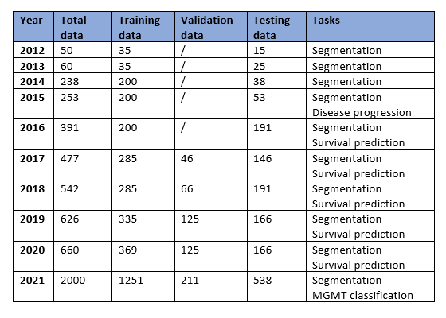

Toutes les exécutions d’entrainement de notre modèle ont été effectué à l’aide de « Kaggle ». C’est une plateforme en ligne qui permet d’écrire des programmes en langage Python et offre des outils pour le calcul à haute performance avec un accès gratuit aux GPUs. 
Nous avons utilisé le Nvidia P100 avec 30 Go de disque en exécution hors ligne s’appuie sur la technologie Turing révolutionnaire à coeurs Tensor pour offrir des performances de calcul multi-précision avec une grande variété de charges de travail. 
Ce GPU accélère une grande variété de charges de travail notamment l’entraînement Deep Learning, le Machine Learning, l’analyse de données et le traitement graphique, donc c’est l’idéal pour la segmentation des d’images volumineuses en utilisant des réseaux d’apprentissage profond 3D.

# Architecture : 
Voici une vue générale du système attendu:

 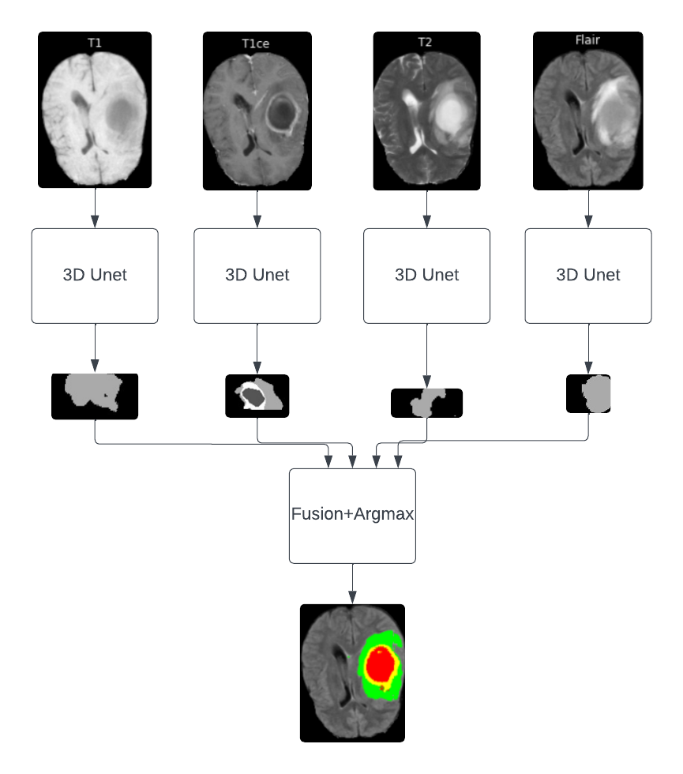

L'architecture U-Net est un réseau de neurones convolutifs (CNN) utilisé principalement dans le domaine de la segmentation d'images biomédicales, mais aussi dans d'autres domaines de vision par ordinateur. Elle a été proposée en 2015 par Olaf Ronneberger, Philipp Fischer et Thomas Brox dans un article intitulé "U-Net: Convolutional Networks for Biomedical Image Segmentation".

L'architecture U-Net est caractérisée par sa forme en U, où le réseau comporte à la fois une partie d'encodeur (à gauche du U) et une partie de décodeur (à droite du U). L'encodeur capture les caractéristiques de l'image en réduisant progressivement la résolution spatiale, tandis que le décodeur restaure la résolution spatiale tout en effectuant une segmentation fine. Des connexions résiduelles entre les couches d'encodeur et de décodeur aident à préserver les informations importantes pendant le processus de segmentation.

 
Représentation de l’architecture U-Net présentée par (Ronneberger et al., 2015):

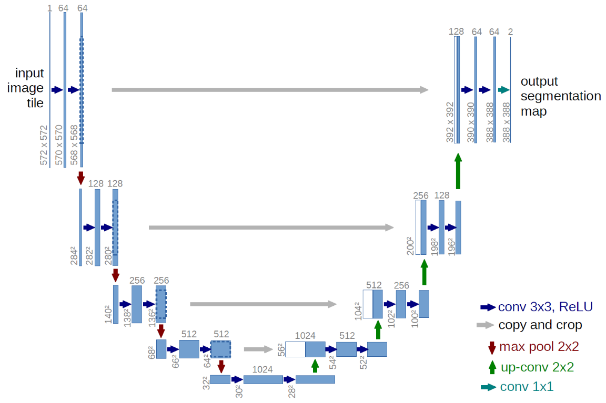

L’architecture U-Net 3D proposée est un U-Net auquel nous avons ajouté une troisième dimension tout en gardant le Channel à 1 et en adaptant l’entrée à 128 x 128 x 128 qui est la taille des patch, nous avons remplacé l’opération de Maxpooling par l’opération de convolution avec un stride = 2. La partie encodeur (gauche) contient 4 blocs de convolution doubles tel que le U-Net ordinaire et commence par un nombre de filtre égal à 24. Chaque bloc contient une couche de normalisation par lots (Batch Normalisation), deux couches de convolution suivie d’une activation ReLU, les deux couches de convolution simple sont suivi d’une couche de convolution de stride 2 au lieu d’une couche de maxpooling (ce remplacement augmente la précision de segmentation) la taille du kernel utilisé est de (4x4x4). De la même manière, le chemin d'expansion est construit en utilisant quatre blocs. Avant chaque bloc, il y a une opération de suréchantillonnage qui augmente la taille de la carte de caractéristiques par 2, suivie d'une convolution (4 × 4 × 4) et d'une concaténation avec les cartes de caractéristiques correspondantes au chemin de contraction. Dans la dernière couche du chemin d'expansion, une convolution (1 × 1 × 1) avec la fonction d'activation Softmax est utilisée pour mettre en correspondance les cartes de caractéristiques multicanaux avec le nombre de classes souhaité.
Entre l’étape d’encodage et de décodage nous avons mis en disposition un bloc « Bottlnek » constitué de quatre couches de convolution simple avec un filtre de taille (4x4x4) et une concaténation avec le résultat de la couche de convolution précédente à chaque fois.
Afin d’éviter le surapprentissage, une couche de dropout (0,1) est ajoutée après chaque couche d’encodage ou de décodage.
 
 
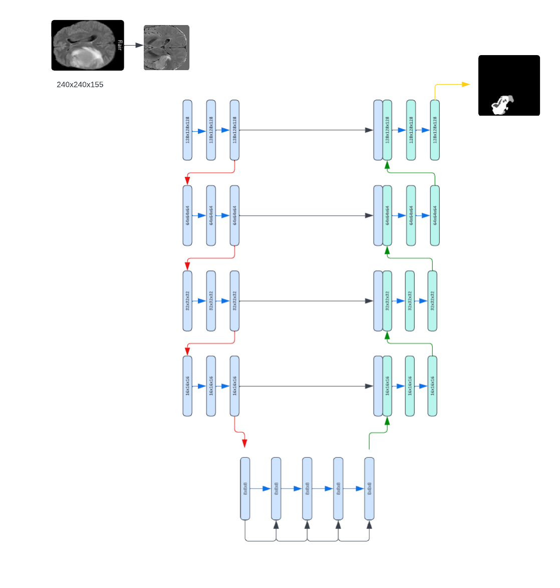
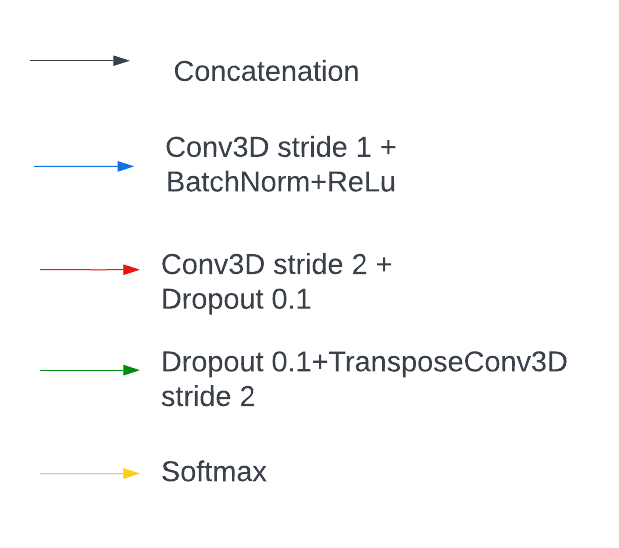

# Démarche suivie et résultats :

## Critères d’évaluation :
Rappelons que pour chaque cas clinique appartenant à la base de données d’apprentissage contient un fichier qui représente la vérité de terrain. C’est un fichier d'étiquettes contenant un volume 3D de la forme (240 × 240 × 155). Les valeurs entières de ce volume indiquent le label ou la classe d’appartenance pour chaque voxel dans les fichiers image correspondants :
<ol>
	<li>La classe 0 : tissu cérébral sain </li>
	<li>La classe 1 : nécrose</li>
	<li>La classe 2 : œdème</li>
	<li>La classe 4 : tumeur active</li>
</ol>
	
	

L’évaluation quantitative des modèles de segmentation entrainés a été effectuée en calculant les quatre indicateurs ou métriques à  savoir le coefficient Dice, la sensibilité, la spécificité et la distance de Hausdorff ; pour trois zones tumorales différentes avec la structure suivante : 
<ol>
	<li>
	Tumeur entière WT (Whole Tumor) : comprend trois structures tumorales : la nécrose, l’œdème et la tumeur active (label 1, 2, 4 resp.).	
	</li>
	<li>
	Noyau tumoral CT (Core Tumor) : cette zone comprend la nécrose (label 1) et la tumeur active (label 4).
	</li>
	<li>
	La tumeur active ET (Enhanced Tumor) : comprend la partie active (label 4).	
	</li>
</ol>
	
	
	

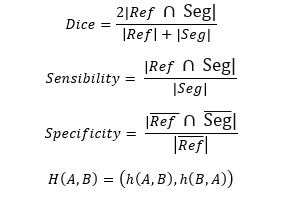

En plus de l’évaluation quantitative, le modèle conçu subie une évaluation qualitative, elle consiste à une comparaison visuelle d’une coupe 2D entre les labels des vérités de terrain et les labels prédites par le modèle. Il vaut mieux que ce type d’évaluation soit réalisée par un expert pour assurer la fiabilité. 
La fonction loss utilisé est la DiceLoss

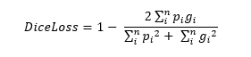

Où les sommes portent sur les n voxels du volume de segmentation prédit p_i et du volume de vérité terrain g_i.

## Scénario 1 :

En premier lieu nous avons choisit d’extraire 4 patchs de taille 128 x 128 x 16 par cas clinique, ces patchs sont extraits de sorte qu’ils englobent 95% de la partie tumorale en utilisant la GT.
Nous avons entrainé le modèle sur ces patchs mais nous avons vite abandonné ce scénario vu que le modèle a du mal avec les parties du cerveau non atteint :

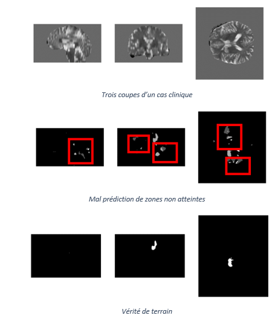

## Scénario 2 :
Nous avons essayé d’augmenter le nombre de patch en prenons 4 patchs avec des parties tumorale et 4 patchs non atteint, mais vu que les patch seront quasiment les memes pour chaque cas,le modèle a présenté un sur-apprentissage :

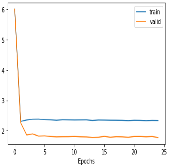
 

## Scénario 3 :
La meilleure solution serait donc de prendre un patch aléatoire de taille 128 x128 x128, ceci va varier les patch pour chaque cas clinique durant les epochs.
Nous avons utilisé les techniques d’augmentation de donnée (Miroir, elastic , luminosité, rotation).
En premier lieu, nous avons opter pour un LearningRate= 0.001, les premières itérations donnaient de bons résultats, sauf qu’à partir d’un certain seuil la fonction perte prenait une allure ascendante.
Dans une seconde étape nous avons fixé LR à 0.0002 et ça a donné de bien meilleurs résultats. 
Après plusieurs essaies sur notre modèle nous avons constaté que la meilleure approche consisterait à commencer l’entrainement à partir d'un taux d'apprentissage relativement élevé, car initialement les poids sont initialisés de façon aléatoire et ils sont loin d'être optimaux, puis le modifier au fur et à mesure que l’entrainement progresse pour permettre des mises à jour plus précises des poids.
La meilleure formule que nous avons gardée est la suivante :

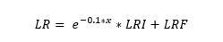  

où x représente le numéro de l’itération en cours le LRI représente le taux d’apprentissage (Learning Rate) initial LRI=0.001 et LRF le taux avec lequel se stabilise notre taux d’apprentissage après plusieurs itérations, nous avons choisis LRF correspondant au meilleur LR fixe choisis et donc  LRF=0.0002 . Notons que cette formule est propre à nous, et qu’elle est obtenu après une dizaine de scénarios exécutés.

Voici un tableau qui résume les paramètres d’entrainement :

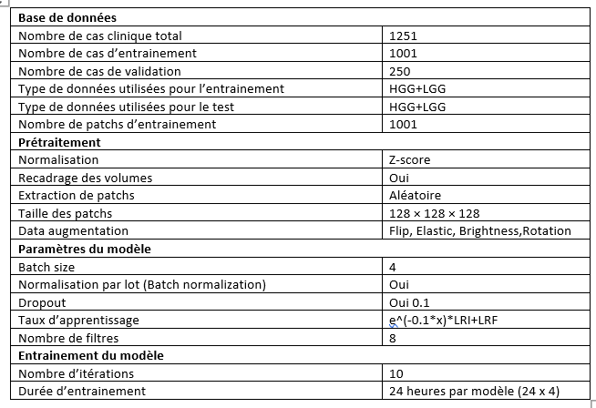
  
  
Loss obtenu pour les 4 modèles entrainé:

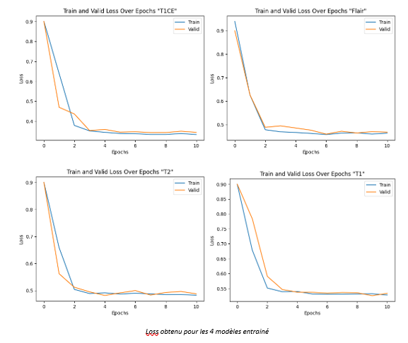
  
  
Dice score pour les 4 modèles:

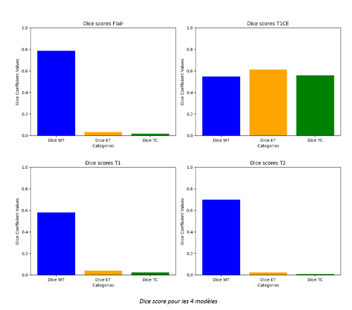

Nous pouvons constater que le dataset BraTS constitue un biais, les modalités T1 et T2 n’ont pas d’influence sur la segmentation finale, en effet il suffit d’utiliser les modalité Flair pour la WT et T1Ce pour ET et TC.

Score obtenu après fusion des résultats :

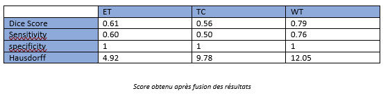

Voici quelques exemples de segmentations obtenus (voir tout l’ensemble de validation ici https://colab.research.google.com/drive/1EBZRkCwhVAUQi7BKf7_mOdpPWuYOFgV1?usp=sharing ) :

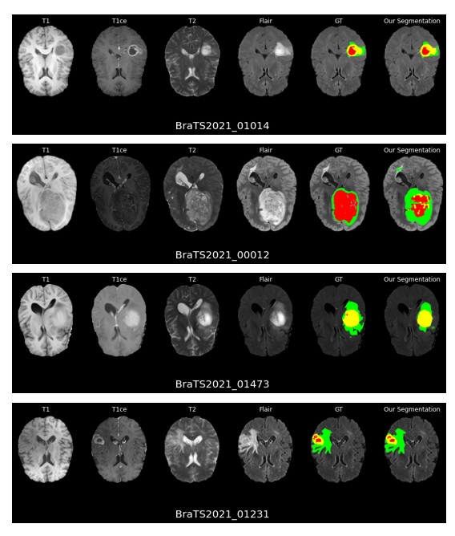
 

 
 
 

